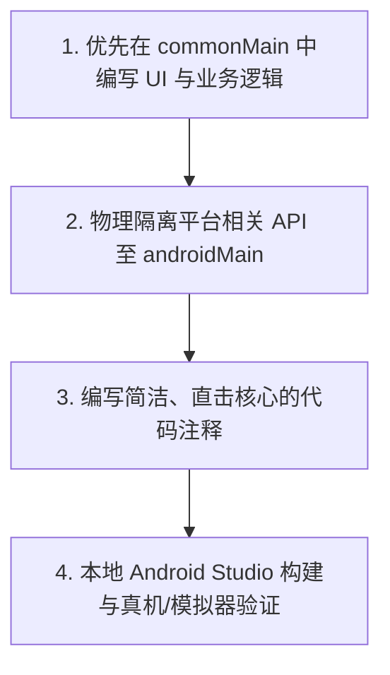

# AGENTS.md - 2FMusic-Android 开发工作流与红线

## 1. 架构核心规则 (只保留 Android 端但保持多平台解耦)
*   **平台代码隔离**：所有 UI 界面、网络请求 (Ktor)、本地数据持久化 (SQLDelight) 及状态控制逻辑必须写在 `composeApp/src/commonMain` 下。
*   **物理解耦红线**：严禁在 `commonMain` 中引入任何特定平台的 API (如 `android.content.Context`、`android.widget.Toast` 等)。
*   **接口注入规范**：若需要使用平台特定能力（如音频播放、Toast 提示、系统通知），必须在 `commonMain` 中声明接口契约，并在 `androidMain` 中提供对应的 `actual` 实现或通过具体实现类实施依赖注入。
*   **架构退化禁止**：严禁为了开发便利将 KMP 目录合并或重构为传统单平台 Android 目录，必须完整保留 `commonMain` 与 `androidMain` 的抽象解耦结构，以保证将来可低成本适配 iOS 或 Desktop (Windows) 等其他平台。

## 2. 核心工作流

1.  **高复用开发**：优先将新功能和新界面全部实现于 `commonMain` 下。
2.  **平台化适配**：如果涉及多媒体播放、后台 Service、平台权限申请等，通过接口向外抽象并在 `androidMain` 中做平台适配。
3.  **编码注释**：注释必须极其简洁高效、直击核心，无任何冗余赘述。

## 3. 开发红线
*   **报错红线**：严禁压制或隐藏报错，任何 Crash 或编译 Error 必须追查根本原因并彻底修复。
*   **安全红线**：严禁在代码、资源文件或日志中硬编码任何敏感凭证、密码或 Token。

